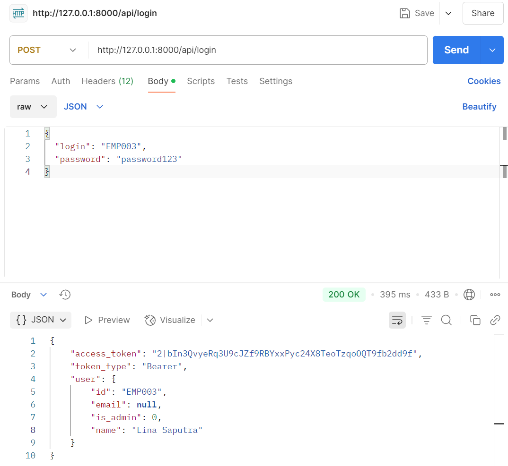
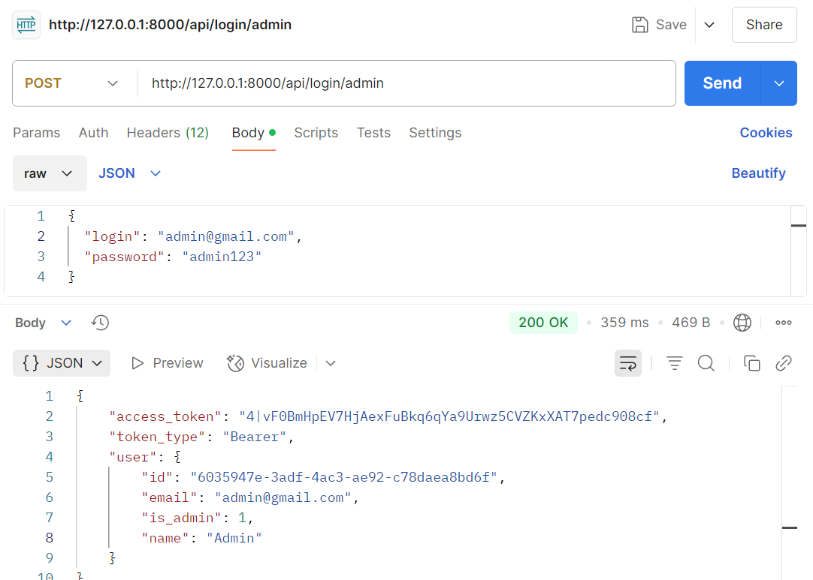

## Setup Laravel Sanctum

composer require laravel/sanctum

create database di mysql dulu, nama database "hris_db"

php artisan migrate --seed

php artisan serve

open postman terus ganti method GET menjadi POST. Ketikkan http://localhost:8000/api/login (Ini untuk login employee)

Dibawah Method POST pilih function Headers Terus masukkan seperti pada gambar

Setelah Headers di setting, pindah ke function Body ganti menjadi raw dengan format JSON

Inputkan EMP002-EMP010 dengan password semuanya "password123"
{
"login": "EMP002",
"password": "password123"
}

bisa juga inputkan dengan email, tapi cuma buat EMP001 saja
{
"login": "amanda@gmail.com",
"password": "amanda123"
}

Klik Send.

Ketikkan http://localhost:8000/api/login/admin (Ini untuk login ADMIN)
Inputkan
{
"login": "admin@gmail.com",
"password": "admin123"
}

Klik Send.

### NOTE : Coba id atau password disalahkan, outputnya sesuai tidak? jika tidak kabarin

## Note

### Kalo error gpt dulu, aku gaiso benakne lek ga langsung
