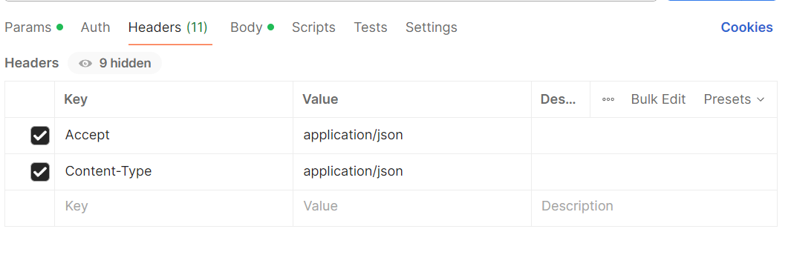
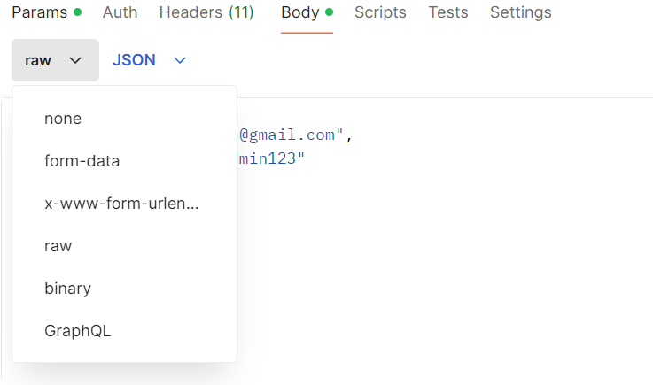
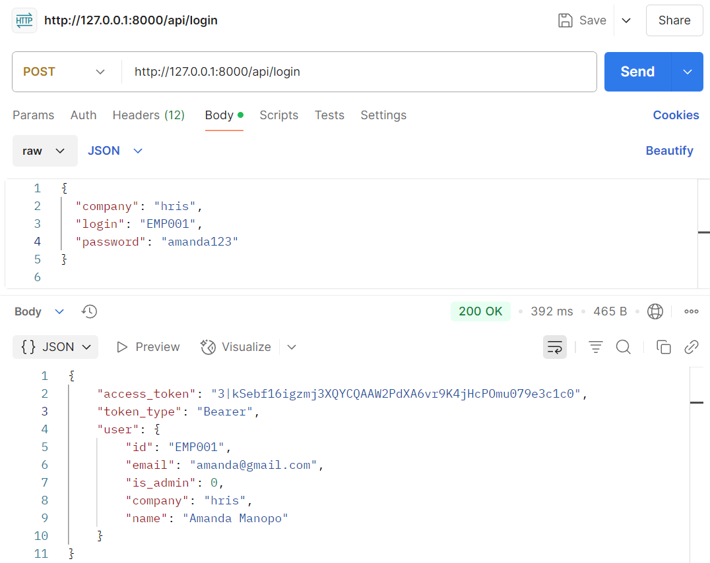
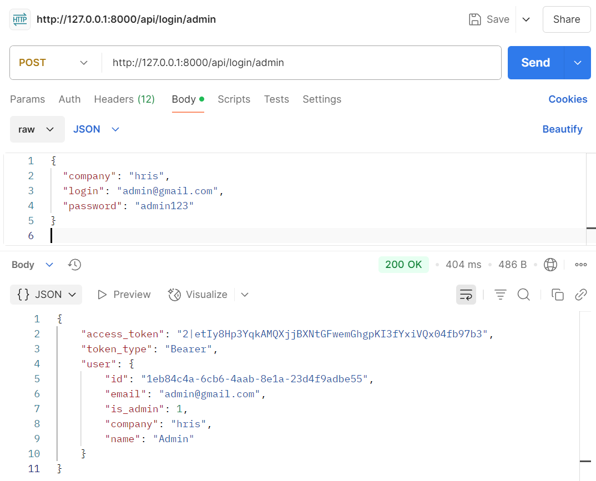
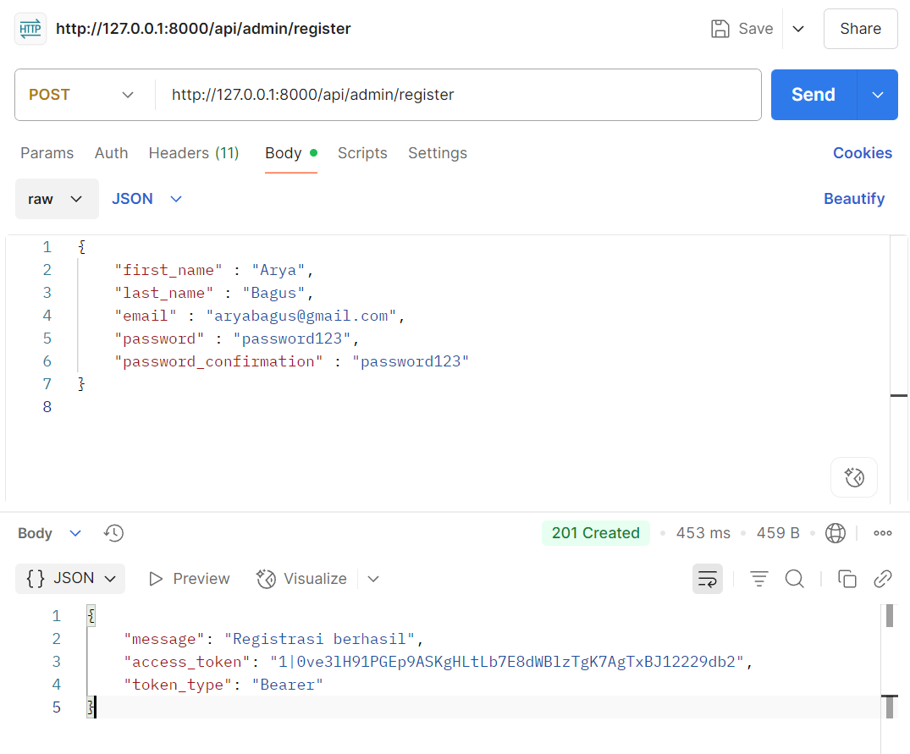
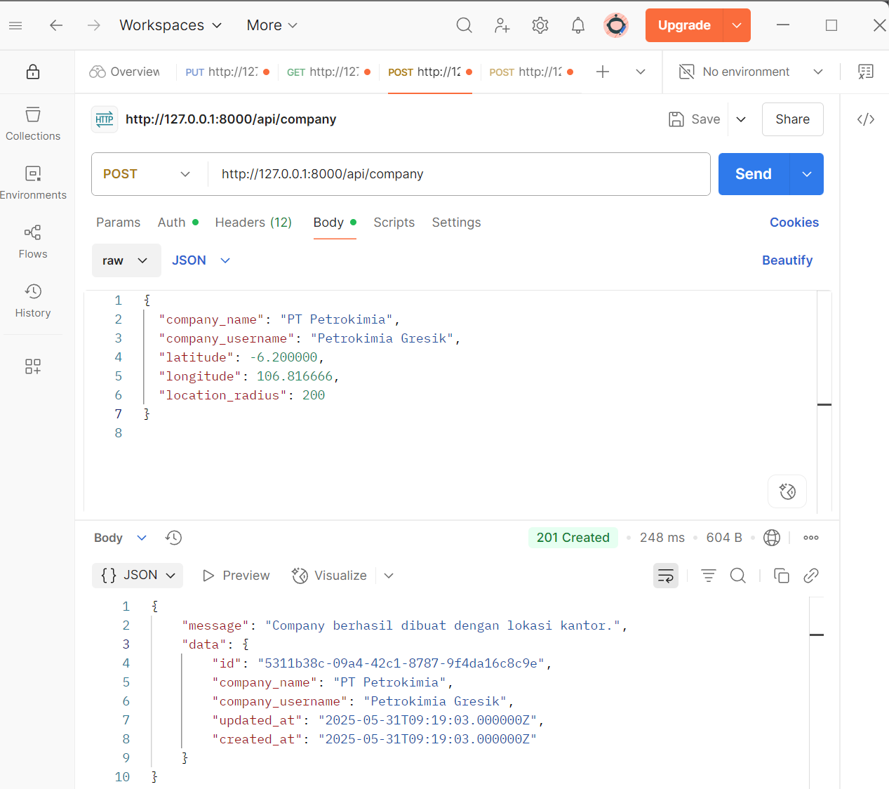
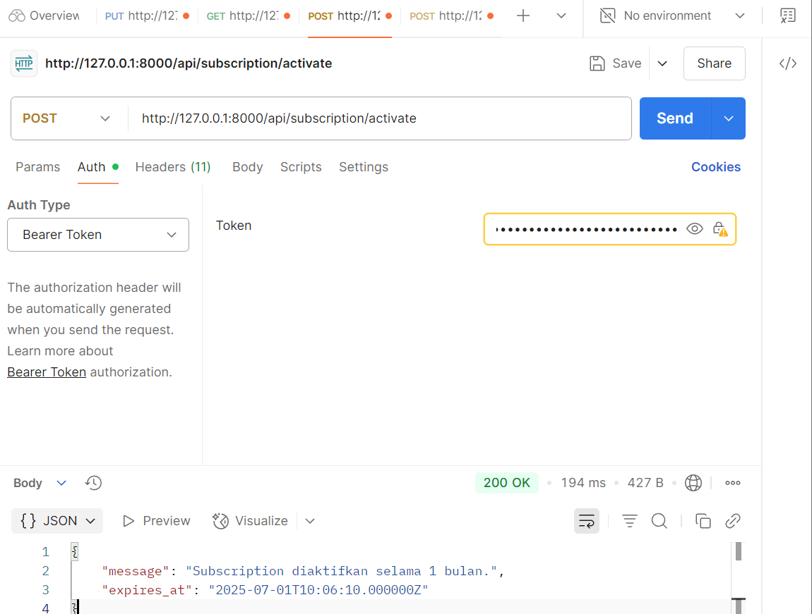
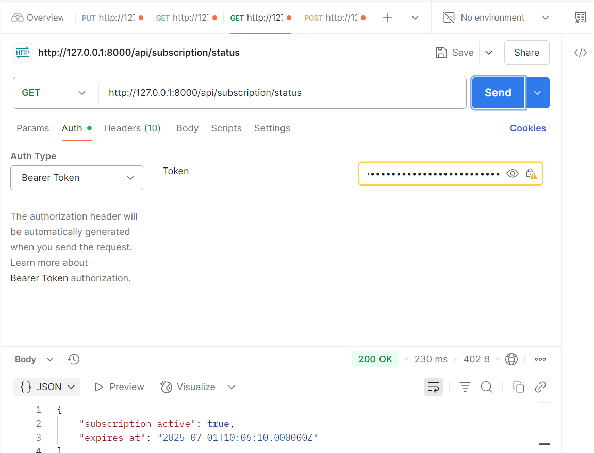
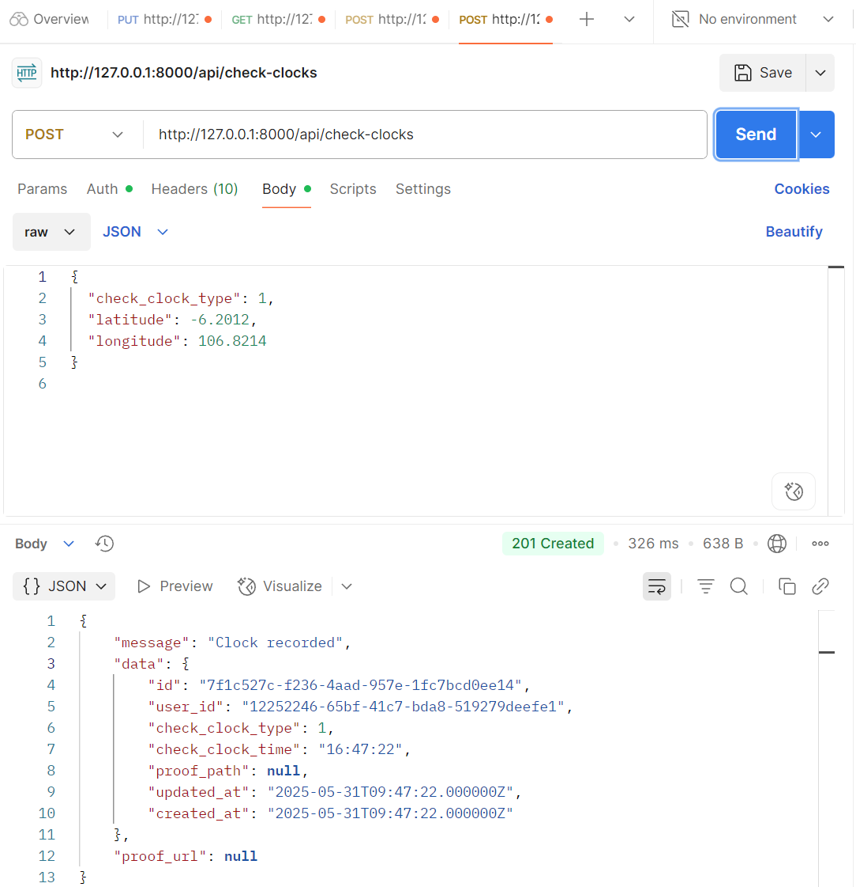
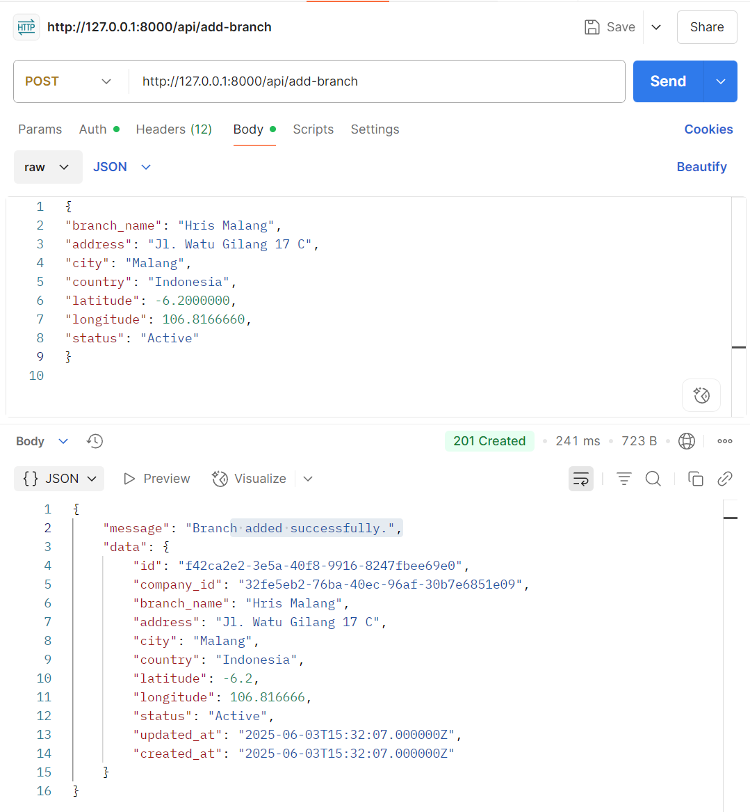

## Setup Laravel Sanctum

composer require laravel/sanctum

create database di mysql dulu, nama database "hris_db"

php artisan migrate --seed

php artisan serve

open postman terus ganti method GET menjadi POST. Ketikkan http://localhost:8000/api/login (Ini untuk login employee)

Dibawah Method POST pilih function Headers Terus masukkan seperti pada gambar

Setelah Headers di setting, pindah ke function Body ganti menjadi raw dengan format JSON

Inputkan EMP003-EMP010 dengan password semuanya "password123"
{
"company": "hris",
"login": "EMP003",
"password": "password123"
}

Inputkan EMP002 dengan password semuanya "trio123" dengan company jti
{
"company": "jti",
"login": "EMP002",
"password": "trio123"
}

bisa juga inputkan dengan email, tapi cuma buat EMP001 saja
{
"company": "hris",
"login": "amanda@gmail.com",
"password": "amanda123"
}

Klik Send.

Ketikkan http://localhost:8000/api/login/admin (Ini untuk login ADMIN)
Inputkan
{
"company": "hris",
"login": "admin@gmail.com",
"password": "admin123"
}

API
POST /api/admin/register

POST /api/admin/login

POST /api/employee/login

POST /api/logout

GET /api/user

Klik Send.

### Coba company, id atau password disalahkan, outputnya sesuai tidak? jika tidak kabarin

## Note

### Kalo error gpt dulu, aku gaiso benakne lek ga langsung

admin register

{
"first_name" : "Arya",
"last_name" : "Bagus",
"email" : "aryabagus@gmail.com",
"password" : "password123",
"password_confirmation" : "password123"
}

company register postman json

{
"company_name": "PT Petrokimia",
"company_username": "Petrokimia Gresik",
"latitude": -6.200000,
"longitude": 106.816666,
"location_radius": 200
}

admin aktivasi subscription

POST http://127.0.0.1:8000/api/subscription/activate
{
"plan": "Basic Plan"
}
atau
{
"plan": "Pro Plan"
}

admin cek durasi subscription

GET http://127.0.0.1:8000/api/subscription/status

employee clock in atau absen masuk (subscription)

POST http://127.0.0.1:8000/api/clock-in
{
"check_clock_type": 1,
"latitude": -6.2000,
"longitude": 106.8214
}

employee clock out atau absen keluar (subscription)

POST http://127.0.0.1:8000/api/clock-out
{
"check_clock_type": 2,
"latitude": -6.2000,
"longitude": 106.8214
}

Admin add branch
POST http://127.0.0.1:8000/api/add-branch

{
"branch_name": "Hris Malang",
"address": "Jl. Watu Gilang 17 C",
"city": "Malang",
"country": "Indonesia",
"latitude": -6.2000000,
"longitude": 106.8166660,
"status": "Active"
}
