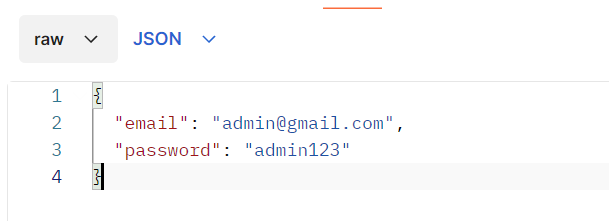

## Setup Laravel Sanctum

composer require laravel/sanctum

create database di mysql dulu, nama database "hris_db"

php artisan migrate --seed

php artisan serve

open postman terus ganti method GET menjadi POST. Ketikkan http://localhost:8000/api/login

Dibawah Method POST pilih function Headers Terus masukkan seperti pada gambar

Setelah Headers di setting, pindah ke function Body ganti menjadi raw dengan format JSON

Inputkan
{
"email": "admin@gmail.com",
"password": "admin123"
}

Klik Send.

## Note

### Kalo error gpt dulu, aku gaiso benakne lek ga langsung
